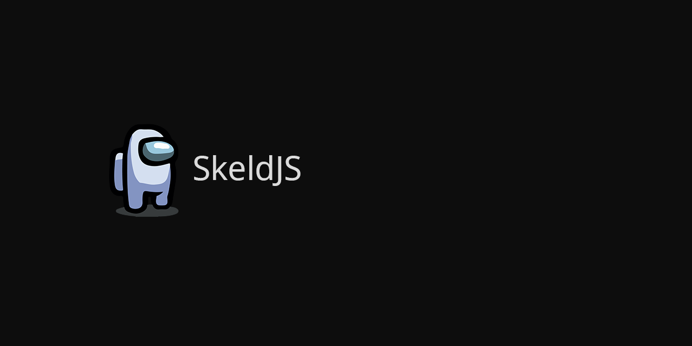

# Skeld JS

SkeldJS is a JavaScript implementation of the Among Us protocol, featuring several different projects, written in TypeScript.
* **Region Server** - Host your own Among Us server, complete with plugins and a Server-as-a-Host solution.
* **Client** - An Among Us client that allows you to host games, join games and act as a player programmatically.
* **Proxy** - A proxy with both a programmable client and an electron client, to inspect and modify packets in detail.

This repository also hosts utility packages for the projects.
* **Common** - Common Among Us structures and game objects that are shared across all main projects.
* **Protocol** - Protocol interfaces with full parsing and composing.
* **Constant** - Enums & data in Among Us that never change.

## Installation
### Prerequisites
* [Node.js >=15](https://nodejs.org)
* [NPM](https://npmjs.org) (Installs with nodejs)
* [Yarn](https://yarnpkg.com) (Can be installed with `npm install -g yarn` once `npm` has installed.)
* [Git](https://git-scm.org)
* A command prompt

### Install repository and packages
Open a command prompt in a folder of your choosing.

1. Install the repository with `git clone https://github.com/SkeldJS/SkeldJS`

2. Enter the server install directory with `cd SkeldJS/packages/skeldjs`

3. Install packages for the repository with `yarn install`

### Configure and start
To configure the server, open `config.json` in in any text editor.

Insert plugins in the `plugins` directory.

Enter `npm start` in the command prompt to start the server.

## Connection
To connect, you can use `npm run set-server localhost 127.0.0.1`

Or alternatively, you can use any of the following programs developed by others.
* https://github.com/Koupah/Among-Us-Editor/releases
* https://github.com/andruzzzhka/CustomServersClient/releases
* https://impostor.github.io/Impostor/

# Notes
> The most comprehensive set of JavaScript protocol implementations for Among Us.

This repository is held under the GPL-V3 license, meaning I am not responsible for any consequences that may come from using the packages in SkeldJS.